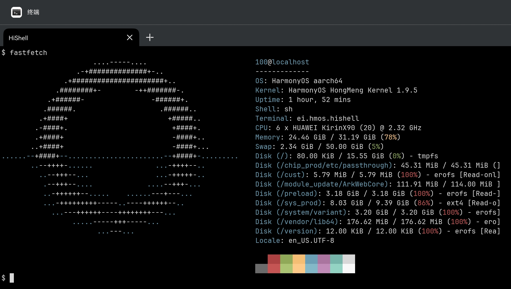

# Termony

[GitHub](https://github.com/jiegec/Termony) [Gitee](https://gitee.com/jiegec/Termony) - [中文](README_CN.md)

Termux for HarmonyOS Computer. 开发进行中。

目前可以在华为 MateBook Pro 上运行一些基本命令：


还可以在 HarmonyOS Computer 上编译和运行 C/C++ 程序：


## 概述

内置软件包：

||||||
| --- | --- | --- | --- | --- |
| aria2 | bash | binutils | busybox | c-ares |
| coremark | curl | elf-loader | expat | fastfetch |
| fish | gcc | gdb | gettext | git |
| glib | gmp | hdc | htop | kbd |
|lib{archive|event|ffi|idn2|unistring}|
| lz4 | make | mpc | mpfr | ncnn |
|ncurses|openssh|openssl|pcre2|proot|
|python|qemu|qemu-vroot|readline|sl|
|strace|stream|talloc|tar|tmux|
|tree|vim|vkpeak|xxhash|xz|
|yyjson|zstd|

- [elf-loader](https://github.com/MikhailProg/elf): 无需可执行权限即可运行可执行文件！例如：`cp /data/app/bin/bash ~/ && loader ~/bash`
- qemu{,vroot}: 无需可执行权限即可运行可执行文件！例如：`cp /data/app/bin/bash ~/ && qemu-aarch64 ~/bash`
- qemu-system-{aarch64,x86_64}: 可以使用 qemu-system 启动系统模拟器。

小提示：可以在内置终端应用中使用这些工具 `/data/service/hnp`:



尽管由于前缀设置为 `/data/app/base.org/base_1.0`（感谢 @duskmoon314），某些路径可能会出错。您可以像这样覆盖它们：

```shell
LD_LIBRARY_PATH=/data/service/hnp/base.org/base_1.0/lib TERMINFO=/data/service/hnp/base.org/base_1.0/share/terminfo fish
```

您可以将它们持久化到 `~/.bashrc`，并在执行其他命令之前运行 bash：

如果您的计算机运行的是 HarmonyOS 6.0 或更高版本，那么您的计算机支持 `sudo` 并允许编辑系统环境变量。您可以将以下环境变量添加到系统环境变量中，以便将来在打开终端后可以直接在 `Termony` 中运行命令，而无需首先执行 `bash` 或 `source ~/.bashrc`。

运行 `sudo vim /data/service/el1/public/startup/profile` 或 `sudo vim /system/etc/profile` 或 `sudo vim /etc/profile`

```shell
if [ -d "/data/service/hnp/base.org/base_1.0" ]; then
  export LD_LIBRARY_PATH=/data/service/hnp/base.org/base_1.0/lib
  export TERMINFO=/data/service/hnp/base.org/base_1.0/share/terminfo
  export VIM=/data/service/hnp/base.org/base_1.0/share/vim
  export TMUX_TMPDIR=/data/storage/el2/base/cache
fi
```

然而，现在无论调试模式应用都可以访问 `mprotect(anon_page, R_X, ...)`，因此您可以在 HiShell 中使用 elf 加载器。
HNP 文件夹在您升级 Termony 时不会更新。您需要重新安装 Termony 以获取最新版本。

终端功能：

- 基本转义序列支持
- 通过上下文菜单粘贴（右键单击激活）
- 在命令行中通过 pbcopy/pbpaste 使用 OSC52 转义序列复制/粘贴

### 在新的根文件系统中运行

`qemu-vroot-aarch64` 是一个用户模式 qemu，修改为模仿 proot 行为。它允许用户运行 Linux 二进制文件（甚至是另一种 CPU 架构的），并像 chroot 或 proot 一样切换到新的根文件系统。

#### Alpine Linux

例如，您可以通过以下步骤在 alpine 根文件系统中运行：

- 从 https://alpinelinux.org/downloads/ 下载 alpine 最小根文件系统（aarch64 或 x64）
- 解压下载的 rootfs tar.gz 文件，为了更好的兼容性，建议使用 `/data/storage/el2/base/files/alpine_rootfs`
```shell
mkdir -p /data/storage/el2/base/files/alpine_rootfs
tar xvf alpine-minirootfs-3.22.0-aarch64.tar.gz -C /data/storage/el2/base/files/alpine_rootfs
```
- 运行 `qemu-vroot-aarch64` 以加载带有根文件系统和环境变量的 busybox shell（对于 x86_64 上的根文件系统，请使用 `qemu-vroot-x86_64`）
```shell
cd /data/storage/el2/base/files/alpine_rootfs
qemu-vroot-aarch64 -E PATH=/bin:/usr/bin:/sbin -E HOME=/root -L ./ ./bin/busybox sh -c 'cd && sh'
```
- 运行 `ls /`，根目录已更改！
```shell
ls /
bin    dev    etc    home   lib    media  mnt    opt    proc   root   run    sbin   srv    sys    tmp    usr    var
```
- 运行 `apk update`，alpine 包管理器运行正常，您可以通过 `apk` 安装包

#### Ubuntu

您还可以通过以下步骤使用 ubuntu 根文件系统：

- 从 [Ubuntu Base 24.04](https://cdimage.ubuntu.com/ubuntu-base/releases/24.04/release/) 下载 ubuntu base 根文件系统（ubuntu-base-24.04.3-base-arm64.tar.gz）
- 解压下载的 rootfs tar.gz 文件，为了更好的兼容性，建议使用 `/data/storage/el2/base/files/ubuntu_rootfs`
```shell
mkdir -p /data/storage/el2/base/files/ubuntu_rootfs
tar xvf ubuntu-base-24.04.3-base-arm64.tar.gz -C /data/storage/el2/base/files/ubuntu_rootfs
```
- 在 ubuntu 根文件系统中的 `/etc/apt/apt.conf.d/01-vendor-ubuntu` 文件中追加 `APT::Sandbox::User "root";`
```shell
cd /data/storage/el2/base/files/ubuntu_rootfs
echo 'APT::Sandbox::User "root";' >> etc/apt/apt.conf.d/01-vendor-ubuntu
```
- 运行 `qemu-vroot-aarch64` 以在根文件系统中运行 bash shell
```shell
cd /data/storage/el2/base/files/ubuntu_rootfs
qemu-vroot-aarch64 -E PATH=/bin:/usr/bin:/sbin -E HOME=/root -L ./ ./bin/bash -c 'cd && bash'
```
- 运行 `apt update`，apt 包管理器运行正常，您可以通过 `apt` 安装包

## 使用方法（如果您是 Mac 用户）：

1. 将您的 MateBook Pro 连接到 Mac，并在 Mac 上执行以下步骤
2. 递归克隆此仓库，并进入该仓库
3. 在 DevEco-Studio 中设置代码签名，忽略任何警告
4. 从 Homebrew 或 Nix 安装 `wget`、`coreutils`、`make`、`gsed`、`gettext`、`automake`、`cmake`、`pkg-config` 和 `ncurses`
5. （M 系列用户）`export PATH="/opt/homebrew/opt/coreutils/libexec/gnubin:/opt/homebrew/opt/gnu-sed/libexec/gnubin:/opt/homebrew/opt/make/libexec/gnubin:$PATH"`
6. 运行 `./create-hnp.sh` 创建 hnp 包
7. 运行 `./build-macos.sh`
8. 运行 `./push.sh ./entry/build/default/outputs/default/entry-default-signed.hap`
9. 在您的 HarmonyOS 计算机上尝试 Termony

## 使用方法（如果您是 Linux 用户）：

1. 将您的 MateBook Pro 连接到 Linux 机器，并执行以下步骤
2. 递归克隆此仓库，并进入该仓库
3. 在 DevEco-Studio 中设置代码签名，忽略任何警告
4. 设置 DevEco 命令行工具，并确保 `$TOOL_HOME` 环境变量是 SDK 的正确目录
5. 运行 `./build-linux.sh -b` 创建 hnp 包
6. 运行 `./build-linux.sh -s` 对 hap 文件进行签名
7. 运行 `./build-linux.sh -p` 将 Termony 推送到设备并安装
8. 在您的 HarmonyOS 计算机上尝试 Termony

## 使用方法（如果您是 Windows 用户）：

1. 将您的 MateBook Pro 连接到 Windows 机器，并执行以下步骤
2. 安装 WSL（推荐 Ubuntu），并按照以下步骤构建 hap
3. 递归克隆此仓库，并进入该仓库
4. 在 DevEco-Studio 中设置代码签名，忽略任何警告
5. 在 WSL 中设置 DevEco 命令行工具，并确保 `$TOOL_HOME` 环境变量是 SDK 的正确目录
6. 在 WSL 中运行 `./build-linux.sh -b` 创建 hnp 包
7. 在 WSL 中运行 `./build-linux.sh -s` 对 hap 文件进行签名
8. 在 Windows 终端中，使用 `hdc` 发送和安装 hap 文件，如 `build-linux.sh` 中的 `hdc_push`
9. 在您的 HarmonyOS 计算机上尝试 Termony

## 它是如何工作的

通过检查 CodeArts IDE，我们发现它使用 HNP 包来运行本地程序。您需要将 `.hnp` 文件打包到 `.hap` 中，并像下面这样添加到 `module.json5`：

```json5
{
  "module": {
    "hnpPackages": [
      {
        "package": "busybox.hnp",
        "type": "private"
      }
    ]
  }
}
```

然后，您需要将 `.hnp` 文件添加到 `.hap` 并手动签名 `.hap`。您可以参考 `sign.py` 查看它是如何完成的。`.hnp` 包会自动解压到 `/data/app` 下，并在 `/data/app/bin` 下创建符号链接。
